# 🛡️ NIAT MK: Smart Biometric Attendance System

<div align="center">


**A Privacy-First, Multi-Modal Attendance & Access Control Solution**

[](https://www.python.org/)
[](https://opencv.org/)
[](https://flask.palletsprojects.com/)
[](https://www.espressif.com/en/products/socs/esp32)
[](LICENSE)

[Features](#-key-features) • [Hardware](#-hardware-integration) • [System Diagram](#-system-architecture) • [Setup](#-quick-start) • [Usage](#-how-to-use) • [Structure](#-project-structure)

</div>

---

## 🌟 Overview

**NIAT MK** is an advanced, fully offline attendance system designed for high-privacy environments like classrooms, laboratories, and small offices. By combining **Face Recognition** (OpenCV LBPH) and **Biometric Fingerprint Matching** (R307 Sensor), it provides a robust, fail-safe solution for attendance tracking and physical access control.

> [!NOTE]
> **Privacy-First Design:** All data processing, model training, and biometric storage happen locally. No cloud, no internet dependencies, no data leaks.

---

## 🚀 Key Features

| Feature | Description |
| :--- | :--- |
| **Dual-Biometric** | Support for Face Recognition (Webcam/ESP32-CAM) and Fingerprint matching. |
| **Offline AI** | Uses LBPH algorithms for high-speed, local face recognition and training. |
| **Smart Reports** | Automated generation of Daily Text summaries and Professional PDF reports. |
| **Dual Interface** | Choose between a **Power-User Terminal** or a **Modern Web Dashboard**. |
| **Access Control** | Integrated relay control for electronic door locks via ESP32. |
| **Live Monitoring** | Real-time MJPEG streaming from remote ESP32-CAM nodes with a digital HUD scanner overlay. |
| **Physical Controls** | Multi-button setup to toggle live previews, display statistics, download reports, or trigger face recognition directly from the hardware. |

---

## 📊 System Architecture

The following block diagram shows how the hardware controller, remote camera node, database, and client dashboards interface over the local network:

```mermaid
flowchart TB
    %% Definitions of styling classes
    classDef mcu fill:#1e1b4b,stroke:#818cf8,stroke-width:2px,color:#e0e7ff,rx:10,ry:10;
    classDef sensor fill:#3c1642,stroke:#b20d30,stroke-width:2px,color:#ffe3e3;
    classDef output fill:#064e3b,stroke:#34d399,stroke-width:2px,color:#d1fae5;
    classDef server fill:#0f172a,stroke:#38bdf8,stroke-width:2px,color:#f0f9ff;
    classDef database fill:#1c1917,stroke:#f59e0b,stroke-width:2px,color:#fef3c7;
    classDef client fill:#030712,stroke:#ec4899,stroke-width:2px,color:#fdf2f8;
    classDef network fill:#111827,stroke:#6b7280,stroke-width:1px,color:#f3f4f6,stroke-dasharray: 5 5;

    %% Main Subgraphs
    subgraph PHYSICAL ["🏢 Physical Location (Entrance)"]
        direction TB

        subgraph ESP_CTRL ["📟 ESP32 Controller (Biometric Node)"]
            direction TB
            MCU["ESP32 DevKit V1<br/>(Main Controller)"]:::mcu
            FP["R307 Fingerprint<br/>Sensor"]:::sensor
            BTN["4x Tactile Buttons<br/>(Preview/Stats/PDF/Face)"]:::sensor
            OLED["0.96 inch SSD1306 OLED<br/>(Status/Stats Display)"]:::output
            RLY["5V Relay Module<br/>(Door Lock Control)"]:::output
            IND["Alert System<br/>(Buzzer & Green/Red LEDs)"]:::output

            %% Internal Connections
            MCU -- "UART (TX25/RX26)" --> FP
            MCU -- "I2C (SDA21/SCL22)" --> OLED
            MCU -- "GPIO 4 (Signal)" --> RLY
            MCU -- "GPIO Pullup" --> BTN
            MCU -- "GPIO 2,14,15" --> IND
        end

        subgraph ESP_CAM ["📷 ESP32-CAM (Vision Node)"]
            direction TB
            CAM_MCU["ESP32-S AI-Thinker<br/>(Wi-Fi Camera)"]:::mcu
            OV2640["OV2640 Lens<br/>(Vision Input)"]:::sensor
            FLSH["Onboard Flash LED<br/>(Illumination)"]:::output
            SD_CARD["SD Card MMC<br/>(Local Storage)"]:::database

            CAM_MCU --- OV2640
            CAM_MCU --- FLSH
            CAM_MCU --- SD_CARD
        end
    end

    subgraph local_network ["🌐 Local Network (Wi-Fi)"]
        direction LR

        subgraph SERVER ["💻 Flask Backend & AI Core"]
            direction TB
            FLSK["Flask Web Server<br/>(REST API Hub)"]:::server
            CV2["OpenCV Recognition Engine<br/>(LBPH Local Model)"]:::server
            DB_JSON[("Student DB<br/>(JSON Storage)")]:::database
            DB_CSV[("Attendance Logs<br/>(CSV Database)")]:::database
            PDF_GEN["ReportLab Engine<br/>(PDF Generation)"]:::server

            FLSK <--> CV2
            FLSK <--> DB_JSON
            FLSK <--> DB_CSV
            FLSK --> PDF_GEN
        end

        subgraph WEB_CLIENT ["🖥️ User Interfaces"]
            direction TB
            DSH["Web Dashboard<br/>(Glassmorphic Admin UI)"]:::client
            TRM["Terminal UI<br/>(Power-User CLI)"]:::client
        end
    end

    %% Network Inter-connections (with styling labels)
    FP -- "1. Send Biometric ID<br/>(HTTP POST)" --> FLSK
    BTN -- "2. Trigger Action<br/>(HTTP POST)" --> FLSK
    CAM_MCU -- "3. MJPEG Video Stream<br/>(HTTP Stream/Port 81)" --> CV2
    FLSK -- "4. Response Commands<br/>(OLED Text / Unlock Signal)" --> MCU
    
    FLSK -- "5. Live Updates<br/>(Server-Sent Events)" --> DSH
    FLSK <--> TRM
    
    %% Style the connection links for visibility
    linkStyle 12 stroke:#f59e0b,stroke-width:2px;
    linkStyle 13 stroke:#f59e0b,stroke-width:2px;
    linkStyle 14 stroke:#ef4444,stroke-width:2px;
    linkStyle 15 stroke:#10b981,stroke-width:2px;
    linkStyle 16 stroke:#3b82f6,stroke-width:2px;
    linkStyle 17 stroke:#3b82f6,stroke-width:2px;

    %% Overall container styles
    style PHYSICAL fill:#020617,stroke:#1e293b,stroke-width:2px
    style local_network fill:#020617,stroke:#1e293b,stroke-width:2px
    style ESP_CTRL fill:#0b0f19,stroke:#6366f1,stroke-width:2px
    style ESP_CAM fill:#0b0f19,stroke:#14b8a6,stroke-width:2px
    style SERVER fill:#090d16,stroke:#38bdf8,stroke-width:2px
    style WEB_CLIENT fill:#0f0514,stroke:#d946ef,stroke-width:2px
```



> [!TIP]
> 🔍 **Interactive Diagram:** Click to open the [Zoomable & Interactive System Architecture Diagram](https://mermaid.live/edit#base64:eyJjb2RlIjogImZsb3djaGFydCBUQlxuICAgICUlIERlZmluaXRpb25zIG9mIHN0eWxpbmcgY2xhc3Nlc1xuICAgIGNsYXNzRGVmIG1jdSBmaWxsOiMxZTFiNGIsc3Ryb2tlOiM4MThjZjgsc3Ryb2tlLXdpZHRoOjJweCxjb2xvcjojZTBlN2ZmLHJ4OjEwLHJ5OjEwO1xuICAgIGNsYXNzRGVmIHNlbnNvciBmaWxsOiMzYzE2NDIsc3Ryb2tlOiNiMjBkMzAsc3Ryb2tlLXdpZHRoOjJweCxjb2xvcjojZmZlM2UzO1xuICAgIGNsYXNzRGVmIG91dHB1dCBmaWxsOiMwNjRlM2Isc3Ryb2tlOiMzNGQzOTksc3Ryb2tlLXdpZHRoOjJweCxjb2xvcjojZDFmYWU1O1xuICAgIGNsYXNzRGVmIHNlcnZlciBmaWxsOiMwZjE3MmEsc3Ryb2tlOiMzOGJkZjgsc3Ryb2tlLXdpZHRoOjJweCxjb2xvcjojZjBmOWZmO1xuICAgIGNsYXNzRGVmIGRhdGFiYXNlIGZpbGw6IzFjMTkxNyxzdHJva2U6I2Y1OWUwYixzdHJva2Utd2lkdGg6MnB4LGNvbG9yOiNmZWYzYzc7XG4gICAgY2xhc3NEZWYgY2xpZW50IGZpbGw6IzAzMDcxMixzdHJva2U6I2VjNDg5OSxzdHJva2Utd2lkdGg6MnB4LGNvbG9yOiNmZGYyZjg7XG4gICAgY2xhc3NEZWYgbmV0d29yayBmaWxsOiMxMTE4Mjcsc3Ryb2tlOiM2YjcyODAsc3Ryb2tlLXdpZHRoOjFweCxjb2xvcjojZjNmNGY2LHN0cm9rZS1kYXNoYXJyYXk6IDUgNTtcblxuICAgICUlIE1haW4gU3ViZ3JhcGhzXG4gICAgc3ViZ3JhcGggUEhZU0lDQUwgW1wiXHVkODNjXHVkZmUyIFBoeXNpY2FsIExvY2F0aW9uIChFbnRyYW5jZSlcIl1cbiAgICAgICAgZGlyZWN0aW9uIFRCXG5cbiAgICAgICAgc3ViZ3JhcGggRVNQX0NUUkwgW1wiXHVkODNkXHVkY2RmIEVTUDMyIENvbnRyb2xsZXIgKEJpb21ldHJpYyBOb2RlKVwiXVxuICAgICAgICAgICAgZGlyZWN0aW9uIFRCXG4gICAgICAgICAgICBNQ1VbXCJFU1AzMiBEZXZLaXQgVjE8YnIvPihNYWluIENvbnRyb2xsZXIpXCJdOjo6bWN1XG4gICAgICAgICAgICBGUFtcIlIzMDcgRmluZ2VycHJpbnQ8YnIvPlNlbnNvclwiXTo6OnNlbnNvclxuICAgICAgICAgICAgQlROW1wiNHggVGFjdGlsZSBCdXR0b25zPGJyLz4oUHJldmlldy9TdGF0cy9QREYvRmFjZSlcIl06OjpzZW5zb3JcbiAgICAgICAgICAgIE9MRURbXCIwLjk2IGluY2ggU1NEMTMwNiBPTEVEPGJyLz4oU3RhdHVzL1N0YXRzIERpc3BsYXkpXCJdOjo6b3V0cHV0XG4gICAgICAgICAgICBSTFlbXCI1ViBSZWxheSBNb2R1bGU8YnIvPihEb29yIExvY2sgQ29udHJvbClcIl06OjpvdXRwdXRcbiAgICAgICAgICAgIElORFtcIkFsZXJ0IFN5c3RlbTxici8+KEJ1enplciAmIEdyZWVuL1JlZCBMRURzKVwiXTo6Om91dHB1dFxuXG4gICAgICAgICAgICB%%20T1YyNjQwXG4gICAgICAgICAgICBDQU1fTUNVIC0tLSBGTFNIXG4gICAgICAgICAgICBDQU1fTUNVIC0tLSBTRF9DQVJEXG4gICAgICAgIGVuZFxuICAgIGVuZFxuXG4gICAgc3ViZ3JhcGggbG9jYWxfbmV0d29yayBbXCJcdWQ4M2NcdWRmMTAgTG9jYWwgTmV0d29yayAoV2ktRmkpXCJdXG4gICAgICAgIGRpcmVjdGlvbiBMUlxuXG4gICAgICAgIHN1YmdyYXBoIFNFUlZFUiBbXCJcdWQ4M2RcdWRjYmIgRmxhc2sgQmFja2VuZCAmIEFJIENvcmVcIl1cbiAgICAgICAgICAgIGRpcmVjdGlvbiBUQlxuICAgICAgICAgICAgRkxTS1tcIkZsYXNrIFdlYiBTZXJ2ZXI8YnIvPihSRVNUIEFQSSBIdWIpXCJdOjo6c2VydmVyXG4gICAgICAgICAgICBDVjJbXCJPcGVuQ1YgUmVjb2duaXRpb24gRW5naW5lPGJyLz4oTEJQSCBMb2NhbCBNb2RlbClcIl06OjpzZXJ2ZXJcbiAgICAgICAgICAgIERCX0pTT05bKFwiU3R1ZGVudCBEQjxici8+KEpTT04gU3RvcmFnZSlcIildOjo6ZGF0YWJhc2VcbiAgICAgICAgICAgIERCX0NTVlsoXCJBdHRlbmRhbmNlIExvZ3M8YnIvPihDU1YgRGF0YWJhc2UpXCIpXTo6OmRhdGFiYXNlXG4gICAgICAgICAgICBQREZfR0VOW1wiUmVwb3J0TGFiIEVuZ2luZTxici8+KFBERiBHZW5lcmF0aW9uKVwiXTo6OnNlcnZlclxuXG4gICAgICAgICAgICBGTFNLIDwtLT4gQ1YyXG4gICAgICAgICAgICBGTFNLIDwtLT4gREJfSlNPTlxuICAgICAgICAgICAgRkxTSyA8LS0+IERCX0NTVlxuICAgICAgICAgICAgRkxTSyAtLT4gUERGX0dFTlxuICAgICAgICBlbmRcblxuICAgICAgICBzdWJncmFwaCBXRUJfQ0xJRU5UIFtcIlx1ZDgzZFx1ZGRhNVx1ZmUwZiBVc2VyIEludGVyZmFjZXNcIl1cbiAgICAgICAgICAgIGRpcmVjdGlvbiBUQlxuICAgICAgICAgICAgRFNIW1wiV2ViIERhc2hib2FyZDxici8+KEdsYXNzbW9ycGhpYyBBZG1pbiBVSSlcIl06OjpjbGllbnRcbiAgICAgICAgICAgIFRSTVtcIlRlcm1pbmFsIFVJPGJyLz4oUG93ZXItVXNlciBDTEkpXCJdOjo6Y2xpZW50XG4gICAgICAgIGVuZFxuICAgIGVuZFxuXG4gICAgJSUgTmV0d29yayBJbnRlci1jb25uZWN0aW9ucyAod2l0aCBzdHlsaW5nIGxhYmVscylcbiAgICBGUCAtLSBcIjEuIFNlbmQgQmlvbWV0cmljIElEPGJyLz4oSFRUUCBQT1NUKVwiIC0tPiBGTFNLXG4gICAgQlROIC0tIFwiMi4gVHJpZ2dlciBBY3Rpb248YnIvPihIVFRQIFBPU1QpXCIgLS0+IEZMU0tcbiAgICBDQU1fTUNVIC0tIFwiMy4gTUpQRUcgVmlkZW8gU3RyZWFtPGJyLz4oSFRUUCBTdREWBMb2NhbCBTdG9yYWdlKVwiXTo6OmRhdGFiYXNlXG5cbiAgICAgICAgICAgIENBTV9NQ1UgLS0tIE9WMjY0MFxuICAgICAgICAgICAgQ0FNX01DVSAtLS0gRkxTS1xuICAgICAgICAgICAgQ0FNX01DVSAtLS0gU0RfQ0FSRFxuICAgICAgICBlbmRcbiAgICBlbmRcblxuICAgIHN1YmdyYXBoIGxvY2FsX25ldHdvcmsgW1wiXHVkODNjXHVkZjEwIExvY2FsIE5ldHdvcmsgKFdpLUZpKVwiXVxuICAgICAgICBkaXJlY3Rpb24gTFJcblxuICAgICAgICBzdWJncmFwaCBTRVJWRVIgW1wiXHVkODNkXHVkY2JiIEZsYXNrIEJhY2tlbmQgJiBBSSBDb3JlXCJdXG4gICAgICAgICAgICBkaXJlY3Rpb24gVEJcbiAgICAgICAgICAgIEZMU0tbXCJGbGFzayBXZWIgU2VydmVyPGJyLz4oUkVTVCBBUEkgSHViKVwiXTo6OnNlcnZlclxuICAgICAgICAgICAgQ1YyW1wiT3BlbkNWIFJlY29nbml0aW9uIEVuZ2luZTxici8+KExCUEggTG9jYWwgTW9kZWwpXCJdOjo6c2VydmVyXG4gICAgICAgICAgICBEQl9KU09OWyhcIlN0dWRlbnQgREI8YnIvPihKU09OIFN0b3JhZ2UpXCIpXTo6OmRhdGFiYXNlXG4gICAgICAgICAgICBEQl9DU1ZbKFwiQXR0ZW5kYW5jZSBMb2dzPGJyLz4oQ1NWIERhdGFiYXNlKVwiKV06OjpkYXRhYmFzZVxuICAgICAgICAgICAgUERGX0dFTltcIlJlcG9ydExhYiBFbmdpbmU8YnIvPihQREYgR2VuZXJhdGlvbilcIl06OjpzZXJ2ZXJcblxuICAgICAgICAgICAgRkxTSyA8LS0+IENWMlxuICAgICAgICAgICAgRkxTSyA8LS0+IERCX0pTT05cbiAgICAgICAgICAgIEZMU0sgPC0tPiBEQl9DU1ZcbiAgICAgICAgICAgIEZMU0sgLS0+IFBERl9HRU5cbiAgICAgICAgZW5kXG5cbiAgICAgICAgc3ViZ3JhcGggV0VCX0NMSUVOVCBbXCJcdWQ4M2RcdWRkYTVcdWZlMGYgVXNlciBJbnRlcmZhY2VzXCJdXG4gICAgICAgICAgICBkaXJlY3Rpb24gVEJcbiAgICAgICAgICAgIERTSFtcIldlYiBEYXNoYm9hcmQ8YnIvPihHbGFzc21vcnBoaWMgQWRtaW4gVUkpXCJdOjo6Y2xpZW50XG4gICAgICAgICAgICBUUk1bXCJUZXJtaW5hbCBVSTxici8+KFBvd2VyLVVzZXIgQ0xJKVwiXTo6OmNsaWVudFxuICAgICAgICBlbmRcbiAgICBlbmRcblxuICAgICUlIE5ldHdvcmsgSW50ZXItY29ubmVjdGlvbnMgKHdpdGggc3R5bGluZyBsYWJlbHMpXG4gICAgRlAgLS0gXCIxLiBTZW5kIEJpb21ldHJpYyBJRDxici8+KEhUVFAgUE9TVClcIiAtLT4gRkxTS1xuICAgIEJUTiAtLSBcIjIuIFRyaWdnZXIgQWN0aW9uPGJyLz4oSFRUUCBQT1NUKVwiIC0tPiBGTFNLXG4gICAgQ0FNX01DVSAtLSBcIjMuIE1KUEVHIFZpZGVvIFN0cmVhbTxici8+KEhUVFAgU3RyZWFtL1BvcnQgODEpXCIgLS0+IENWMlxuICAgIEZMU0sgLS0gXCI0LiBSZXNwb25zZSBDb21tYW5kczxici8+KE9MRUQgVGV4dCAvIFVubG9jayBTaWduYWwpXCIgLS0+IE1DVVxuICAgIFxuICAgIEZMU0sgLS0gXCI1LiBMaXZlIFVwZGF0ZXM8YnIvPihTZXJ2ZXItU2VudCBFdmVudHMpXCIgLS0+IERTSFxuICAgIEZMU0sgPC0tPiBUUk1cbiAgICBcbiAgICAlJSBTdHlsZSB0aGUgY29ubmVjdGlvbiBsaW5rcyBmb3IgdmlzaWJpbGl0eVxuICAgIGxpbmtTdHlsZSAxMiBzdHJva2U6I2Y1OWUwYixzdHJva2Utd2lkdGg6MnB4O1xuICAgIGxpbmtTdHlsZSAxMyBzdHJva2U6I2Y1OWUwYixzdHJva2Utd2lkdGg6MnB4O1xuICAgIGxpbmtTdHlsZSAxNCBzdHJva2U6I2VmNDQ0NCxzdHJva2Utd2lkdGg6MnB4O1xuICAgIGxpbmtTdHlsZSAxNSBzdHJva2U6IzEwYjk4MSxzdHJva2Utd2lkdGg6MnB4O1xuICAgIGxpbmtTdHlsZSAxNiBzdHJva2U6IzNiODJmNixzdHJva2Utd2lkdGg6MnB4O1xuICAgIGxpbmtTdHlsZSAxNyBzdHJva2U6IzNiODJmNixzdHJva2Utd2lkdGg6MnB4O1xuXG4gICAgJSUgT3ZlcmFsbCBjb250YWluZXIgc3R5bGVzXG4gICAgc3R5bGUgUEhZU0lDQUwgZmlsbDojMDIwNjE3LHN0cm9rZTojMWUyOTNiLHN0cm9rZS13aWR0aDoycHhcbiAgICBzdHlsZSBsb2NhbF9uZXR3b3JrIGZpbGw6IzAyMDYxNyxzdHJva2U6IzFlMjknM2Isc3Ryb2tlLXdpZHRoOjJweFxuICAgIHN0eWxlIEVTUF9DVFJMIGZpbGw6IzBiMGYxOSxzdHJva2U6IzYzNjZmMSxzdHJva2Utd2lkdGg6MnB4XG4gICAgc3R5bGUgRVNQX0NBTSBmaWxsOiMwYjBmMTksc3Ryb2tlOiMxNGI4YTYsc3Ryb2tlLXdpZHRoOjJweFxuICAgIHN0eWxlIFNFUlZFUiBmaWxsOiMwOTAkMTYsc3Ryb2tlOiMzOGJkZjgsc3Ryb2tlLXdpZHRoOjJweFxuICAgIHN0eWxlIFdFQl9DTElFTlQgZmlsbDojMGYwNTE0LHN0cm9rZTojZDk0NmVmLHN0cm9rZS13aWR0aDoycHhcIiwgIm1lcm1haWQiOiAie1xuICBcInRoZW1lXCI6IFwiZGFya1wiXG59IiwgImF1dG9TeW5jIjogdHJ1ZSwgInVwZGF0ZURpYWdyYW0iOiB0cnVlfQ==) in the Mermaid Live Editor. This allows you to pan, zoom, edit, and export the diagram dynamically!

---

## 🔌 Hardware Integration

The system supports a distributed architecture with dedicated hardware nodes.

### 📟 Wiring & Connections

#### 1. ESP32 Controller (Biometric Node)
| Component | ESP32 Pin | Note |
| :--- | :--- | :--- |
| **Fingerprint (R307)** | TX: 25, RX: 26 | Serial2 (57600 baud) |
| **OLED (SSD1306)** | SDA: 21, SCL: 22 | I2C (0x3C) |
| **Relay Module** | GPIO 4 | Controls electronic lock (Active High) |
| **Green LED** | GPIO 14 | Access Granted indicator |
| **Red LED** | GPIO 15 | Access Denied indicator |
| **Active Buzzer** | GPIO 2 | Audio feedback |
| **Button 1 (Preview)** | GPIO 13 | Starts camera stream preview on dashboard |
| **Button 2 (Stats)** | GPIO 27 | Displays attendance statistics on OLED |
| **Button 3 (PDF)** | GPIO 32 | Triggers PDF report download on website |
| **Button 4 (Face Recog)** | GPIO 12 | Starts or stops face recognition session |

#### 2. ESP32-CAM (Vision Node)
| Component | ESP32 Pin | Note |
| :--- | :--- | :--- |
| **Flash LED** | GPIO 4 | Remote toggle via Dashboard |
| **SD Card** | SDMMC Mode | Pins 2, 4, 12, 13, 14, 15 |
| **Camera Module** | AI-Thinker | Standard Pinout |

---

## 🛠️ Tech Stack

### Software
- **Core**: Python 3.11+
- **Vision**: OpenCV (contrib-python), Pillow
- **Data**: Pandas, NumPy, Scikit-learn
- **Web**: Flask, Bootstrap 5 (Custom Glassmorphism Theme), Jinja2
- **Reporting**: ReportLab

### Hardware
- **Controllers**: ESP32 DevKit V1, ESP32-CAM (AI-Thinker)
- **Sensors**: R307 Optical Fingerprint Module
- **Displays**: 0.96" I2C OLED (SSD1306)
- **Actuators**: 5V Relay Module, Active Buzzer
- **Controls**: 4x Debounced Tactile Push Buttons

---

## 📦 Quick Start

### 1. Clone & Prep
```bash
git clone https://github.com/lenluarun/NIAT_MK.git
cd NIAT_MK
python -m venv .venv
source .venv/bin/activate  # Windows: .\.venv\Scripts\activate
pip install -r requirements.txt
```

### 2. Configure Hardware
- Open `FP/ESP32_CONTROLLER/ESP32_CONTROLLER.ino` or `FP/ESP32_CAM_SOLO/ESP32_CAM_SOLO.ino`.
- Update `STASSID`, `STAPSK`, and `SERVER_IP` to match your local network.
- Flash the firmware using Arduino IDE.

### 3. Launch System
```bash
# Start the main launcher
python launcher.py

# OR start the web dashboard directly
python web_app.py
```

---

## 🖥️ How To Use

1. **Registration**: Add student details via the Terminal or Web UI.
2. **Capture**: Collect 100+ face samples or enroll fingerprints via the ESP32 node.
3. **Train**: Run the training module to update the local `.yml` model.
4. **Attendance**: 
   - **Face Mode**: Start the recognizer. Once a face is matched, attendance is logged.
   - **Finger Mode**: Place finger on sensor. The node identifies the student and notifies the server.
5. **Report**: Check the `src/data/Attendance/` folder for PDF and CSV reports.

---

## 📂 Project Structure

```text
NIAT_MK/
├── launcher.py            # Unified interface selector
├── web_app.py             # Flask Web Dashboard
├── config/                # JSON System Settings
├── src/
│   ├── core/              # Recognition, Biometric, & Data logic
│   ├── models/            # Trained Models & Haar Cascades
│   ├── data/              # Student Database & Reports
│   └── utils/             # UI Engines & Settings Managers
├── FP/                    # ESP32 Firmware (C++/Arduino)
└── templates/             # Web UI HTML Assets
```

---

## 📐 3D Printed Enclosures & CAD Prompts

To make NIAT MK a fully deployable physical product, you can 3D print custom enclosures for both the **ESP32 Controller** and the **ESP32-CAM**. Both designs are optimized to print on standard desktop 3D printers with a build volume under **250mm x 250mm x 250mm** (e.g., Ender 3, Bambu Lab, Prusa, etc.).

Below are the detailed prompt templates you can copy and paste into an AI assistant (like ChatGPT, Claude, or DeepSeek) to generate **OpenSCAD** code, **Blender Python (bpy)** scripts, or **visual mockups** in image generators like Midjourney. All prompts instruct the assistant to output a model with dimensions under 250mm and configure automatic exporting to standard **.stl** format.

### 1. ESP32 Controller Case (Biometric & Access Node)
This enclosure houses the ESP32 DevKit V1, R307 fingerprint sensor, 0.96" OLED screen, 4 tactile buttons, 2 status LEDs, an active buzzer, and a 5V relay module.

#### 🛠️ OpenSCAD Code Generation Prompt
Copy this prompt to generate the 3D-printable model script:
```text
Act as an expert CAD designer and write a fully valid, compileable, and parameterized OpenSCAD script for a 3D-printable project enclosure for an ESP32 Biometric Controller. 

The enclosure must consist of two parts: a main bottom box and a snap-fit top lid. Include screw pillars (M3) to hold the PCB and to mount the box.

Enclosure Dimensions and Component Openings:
1. Box Dimensions: 110mm width, 85mm depth, 45mm height (well within the 250mm x 250mm x 250mm print limit). Wall thickness: 2mm.
2. Front/Top Lid Interface:
   - Cutout for a 0.96" SSD1306 OLED screen (25mm x 15mm cutout, centered near the top).
   - Cutout for a R307 Fingerprint Sensor (rectangular, 21mm x 20mm, positioned on the right).
   - Cutouts for 4 tactile buttons arranged in a horizontal row (4x circular holes, 7mm diameter, spaced 15mm apart, centered near the bottom).
   - Cutouts for 2 status LEDs (2x circular holes, 5.2mm diameter for standard 5mm LEDs, labeled "Granted" and "Denied" with simple relief markings).
3. Sides/Ports:
   - A rectangular cutout on the left wall for a Micro-USB cable to power the ESP32 DevKit V1 (12mm x 8mm).
   - A rectangular cable exit slot on the right wall for the 5V relay output wires connecting to the door lock (10mm x 8mm).
4. Interior Mounts:
   - 4x screw pillars (height 5mm, outer diameter 6mm, inner hole 2.5mm for M3 screws) to mount the ESP32 DevKit V1 (dimensions: 52mm x 28mm mounting pattern).
   - 2x mounting brackets/clips for the R307 sensor body and the 5V relay module.

Ensure the code uses clean modules, comments, and defines standard '$fn = 50' for smooth curves. Avoid overlapping faces by using small offsets (e.g., epsilon = 0.01) in difference() operations.
```

#### 🐍 Blender Python (bpy) Script Generation Prompt
Copy this prompt to generate the Python script to build the model in Blender and export it directly to `.stl`:
```text
Write a Blender Python (bpy) script to programmatically create a detailed 3D model of the NIAT MK Controller enclosure (bottom box and top lid) and export it to an .stl file.

The script must:
1. Clear the active scene of default objects (cubes, cameras, lights).
2. Create a new Collection named "NIAT_MK_Controller".
3. Model the Main Bottom Box:
   - Create a cube of dimensions 110mm x 85mm x 45mm (confirming size is under the 250mm x 250mm x 250mm limit).
   - Use a Bevel modifier to round the vertical edges (bevel width: 5mm).
   - Shell the box to create a 2mm wall thickness by duplicate-scaling or using a Solidify modifier.
   - Add a Micro-USB port cutout (12mm x 8mm) on the left wall, and a cable exit slot (10mm x 8mm) on the right wall using Boolean operations.
   - Add 4 mounting pillars (cylinders) inside the corners (diameter 6mm, height 5mm) with a 2.5mm hole.
4. Model the Top Lid:
   - Create a flat cover (110mm x 85mm x 3mm), offset along the Z-axis by 47mm so it sits on top.
   - Apply a slight bevel to its edges.
   - Create boolean cutouts on the lid for:
     - OLED screen window (25mm x 15mm, centered near the top).
     - R307 fingerprint sensor window (21mm x 20mm, right side).
     - 4 button holes (7mm diameter circles in a row, spaced 15mm apart).
     - 2 indicator LED holes (5.2mm diameter circles).
5. Set up Materials:
   - Create and apply a matte dark-gray plastic material for the box and lid.
   - Create and assign glass/emission materials for the OLED display area and LEDs.
6. Export the Model:
   - Ensure all geometry is selected or active.
   - Write python code to export the active objects to an STL file named 'controller_case.stl' in the local script directory. (Use standard bpy.ops.wm.stl_export or bpy.ops.export_mesh.stl depending on Blender version).
7. Ensure all operations use context-agnostic API calls (avoid bpy.ops where possible; use direct data creation and mesh manipulation or clean modifier setup).
```

---

### 2. ESP32-CAM Case (Vision Node)
This compact enclosure houses the ESP32-CAM AI-Thinker module and provides mounting options for wall or tripod deployment.

#### 🛠️ OpenSCAD Code Generation Prompt
Copy this prompt to generate the 3D-printable model script:
```text
Act as an expert CAD designer and write a fully valid, compileable, and parameterized OpenSCAD script for a compact 3D-printable enclosure for an ESP32-CAM vision node.

The enclosure must consist of a main body and a slide-in or snap-on back cover. 

Enclosure Dimensions and Component Openings:
1. Box Dimensions: 50mm width, 35mm depth, 22mm height (well within the 250mm x 250mm x 250mm limit). Wall thickness: 1.6mm.
2. Front Face Openings:
   - Circular cutout for the OV2640 camera lens (8.5mm diameter).
   - Rectangular cutout for the onboard flash LED (5mm x 5mm, positioned 6mm below the camera lens).
3. Side/Back Openings:
   - A slot on the side for the Micro-SD card (15mm x 3mm).
   - A circular hole at the bottom for a power cable (5mm diameter) or a cutout for a Micro-USB header.
4. Mounting Options:
   - Add a small flange/tab on the back cover with a 4mm screw hole for wall mounting, or a 1/4" tripod mount nut socket on the bottom wall.

Ensure the code is parameterized, includes variables for tolerances, and uses difference() cleanly.
```

#### 🐍 Blender Python (bpy) Script Generation Prompt
Copy this prompt to generate the Python script to build the model in Blender and export it directly to `.stl`:
```text
Write a Blender Python (bpy) script to programmatically create a detailed 3D model of the ESP32-CAM enclosure (vision node) and export it to an .stl file.

The script must:
1. Clear default objects and create a Collection named "NIAT_MK_ESP32_CAM".
2. Model the Main Camera Enclosure Body:
   - Create a cube of dimensions 50mm x 35mm x 22mm (confirming size is under the 250mm x 250mm x 250mm limit).
   - Apply a bevel to the edges (2mm radius).
   - Shell the box (1.6mm wall thickness) using Boolean/Solidify.
   - Add front-facing cutouts:
     - OV2640 lens hole (8.5mm diameter circle, center).
     - Flash LED window (5mm x 5mm square, 6mm below the lens).
   - Add a side cutout for the Micro-SD card slot (15mm x 3mm).
   - Add a bottom hole for power cable input (5mm diameter).
3. Model the Snap-on Back Cover:
   - Create a flat backing plate (50mm x 35mm x 2mm).
   - Add a wall mounting flange extending from the top (15mm x 15mm x 2mm) with a 4mm screw hole.
4. Materials & Setup:
   - Create a matte gray/black plastic material and assign it to the case.
   - Add a shiny glass material to the camera lens area.
5. Export the Model:
   - Ensure all geometry is selected or active.
   - Write python code to export the active objects to an STL file named 'camera_case.stl' in the local script directory. (Use standard bpy.ops.wm.stl_export or bpy.ops.export_mesh.stl depending on Blender version).
6. Use proper bpy data creation methods and avoid breaking context errors.
```

---

### 3. Unified All-in-One Case (Controller + Camera Node)
For a cleaner wall-mounted deployment, this case houses both the ESP32-CAM and the ESP32 Controller, combining all displays, sensors, cameras, and buttons into a single cohesive terminal.

#### 🛠️ OpenSCAD Code Generation Prompt
Copy this prompt to generate the 3D-printable model script:
```text
Act as an expert CAD designer and write a fully valid, compileable, and parameterized OpenSCAD script for a 3D-printable unified enclosure for the NIAT MK Biometric Access Terminal. This enclosure must house both the ESP32 Controller components and the ESP32-CAM vision module in a single wall-mounted unit.

The enclosure must consist of two parts: a main bottom box and a snap-fit top lid. Include screw pillars (M3) to hold the PCBs and to mount the box.

Enclosure Dimensions and Component Openings:
1. Box Dimensions: 140mm width, 100mm depth, 55mm height (well within the 250mm x 250mm x 250mm print limit). Wall thickness: 2.5mm.
2. Front Face / Top Lid Interface Layout (Top to Bottom):
   - Camera Area (Top):
     - Circular cutout for the OV2640 camera lens (8.5mm diameter) positioned near the top center.
     - Rectangular cutout for the onboard flash LED (5mm x 5mm, positioned 6mm below the lens).
   - Display & Biometric Area (Middle):
     - Cutout for a 0.96" SSD1306 OLED screen (25mm x 15mm, centered below the camera flash).
     - Cutout for the R307 Fingerprint Sensor (rectangular, 21mm x 20mm, positioned to the right of the OLED display).
   - Interface Area (Bottom):
     - Cutouts for 4 tactile buttons arranged in a horizontal row (4x circular holes, 7mm diameter, spaced 15mm apart, centered near the bottom).
     - Cutouts for 2 status LEDs (2x circular holes, 5.2mm diameter for standard 5mm LEDs, labeled "Granted" and "Denied").
3. Sides/Ports:
   - A rectangular cutout on the left wall for a Micro-USB cable to power the ESP32 DevKit V1 (12mm x 8mm).
   - A cable entry slot on the right wall for the 5V relay output wires to the door lock (10mm x 8mm).
4. Interior Mounts:
   - 4x screw pillars (height 5mm, outer 6mm, inner 2.5mm for M3) to mount the ESP32 DevKit V1 (52mm x 28mm mounting pattern).
   - 4x screw pillars to mount the ESP32-CAM board (40mm x 27mm mounting pattern) positioned near the top of the case.
   - Brackets/clips for the R307 sensor and the 5V relay.

Ensure the code uses clean modules, comments, and defines standard '$fn = 50' for smooth curves. Avoid overlapping faces by using small offsets (e.g., epsilon = 0.01) in difference() operations.
```

#### 🐍 Blender Python (bpy) Script Generation Prompt
Copy this prompt to generate the Python script to build the model in Blender and export it directly to `.stl`:
```text
Write a Blender Python (bpy) script to programmatically create a detailed 3D model of the NIAT MK Unified All-in-One enclosure (bottom box and top lid containing both the controller and the camera node) and export it to an .stl file.

The script must:
1. Clear the active scene of default objects.
2. Create a new Collection named "NIAT_MK_Unified_Enclosure".
3. Model the Main Bottom Box:
   - Create a box of dimensions 140mm x 100mm x 55mm (confirming size is under the 250mm x 250mm x 250mm limit).
   - Use a Bevel modifier to round the vertical edges (bevel width: 6mm).
   - Shell the box to create a 2.5mm wall thickness using a Solidify modifier.
   - Add a Micro-USB port cutout (12mm x 8mm) on the left wall and a cable exit slot (10mm x 8mm) on the right wall using Boolean operations.
   - Add 8 mounting pillars (cylinders, outer 6mm, inner 2.5mm) inside the box matching the mounting holes for the ESP32 DevKit V1 and the ESP32-CAM.
4. Model the Top Lid:
   - Create a flat cover (140mm x 100mm x 3mm) offset along the Z-axis by 57mm to sit on top.
   - Apply a slight bevel to its edges.
   - Create boolean cutouts on the lid for:
     - OV2640 camera lens (8.5mm circular hole, top center).
     - Flash LED (5mm x 5mm, centered below the lens).
     - OLED display screen (25mm x 15mm, middle center).
     - R307 fingerprint sensor (21mm x 20mm, middle right).
     - 4 tactile buttons (7mm circular holes in a row, bottom center).
     - 2 indicator LEDs (5.2mm circular holes).
5. Set up Materials:
   - Create and apply a matte dark-gray plastic material for the box and lid.
   - Create and assign glass/emission materials for the camera lens, OLED screen, and status LEDs.
6. Export the Model:
   - Ensure all geometry is selected or active.
   - Write python code to export the active objects to an STL file named 'unified_case.stl' in the local script directory. (Use standard bpy.ops.wm.stl_export or bpy.ops.export_mesh.stl depending on Blender version).
7. Ensure all operations use context-agnostic API calls (avoid bpy.ops where possible; use direct data creation and mesh manipulation or clean modifier setup).
```

---

### 4. Visual Mockup Prompt (Midjourney / DALL-E)
If you want to generate high-quality visual renders of how these cases should look:
```text
A product render of a sleek, industrial-style wall-mounted biometric security device, matte black polymer finish, containing a small rectangular fingerprint sensor glowing with a soft blue ring, a mini OLED display showing status text, two small indicator LEDs (red and green), and 4 circular metallic buttons. Next to it is a compact matching security camera node with a clean lens opening and a small indicator light. Modern sci-fi workspace aesthetic, clean lines, high-detail 3D render, studio lighting, depth of field, 8k resolution.
```

---

## 🤝 Contributing & License

This project is maintained by **E2C TEAM**.
Distributed under the **MIT License**. See `LICENSE` for more information.

---

<div align="center">

**Developed with ❤️ for secure and efficient attendance management.**

</div>
